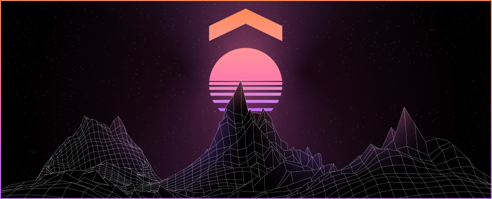

# Ory Summit

Ory Summit is a developer conference organized by Ory and the Ory Community.

Ory Summit provides opportunities to trade insights and experience on best practices, emerging new methods, approaches, and practical solutions around identity and access management in the cloud.

## Ory Summit 2023

### 9th November 2023

**[Get your ticket for Ory Summit 2023 here!](https://summit.ory.sh/)**

A one-day conference around open source end-to-end security and zero trust solutions for the Ory Community - customers, developers, maintainers, and partners.

## Ory Summit 2022

In this repository you can find all publicly available material related to the Ory Summit 2022.

In the Ory Summit 2021 Session Overview you can find recordings and slides for all presentations.

**!---> [Full Ory Summit 2022 Playlist](https://www.youtube.com/playlist?list=PLZ-V_cBgMxH8b1V53hJ1avMYrV6te799i) <---!**

### Ory Summit 20221 Session Overview

An overview of all the sessions and where they can be found to watch after the summit.

**Ory Summit 22**

October 20 2022: 09.30-18.00 CET

---

#### Keynote: Securing the digital World

- [@tacurran](https://github.com/tacurran), Co-founder & CEO of Ory Corp

Recording: https://www.youtube.com/watch?v=wo7eZREQg9s

Presentation: [View & Download Slides](https://github.com/ory/summit/blob/master/Ory_Summit_22_-_Thomas_Curran_-_Securing_the_digital_world.pdf)

---

#### Keynote: Introducing the Ory Network

- [@aeneasr](https://github.com/aeneasr), Co-founder & CEO of Ory Corp

Recording: https://www.youtube.com/watch?v=26dC2nvK978

Presentation: [View & Download Slides](https://github.com/ory/summit/blob/master/Ory_Summit_22_-_Aeneas_Rekkas_Klaus_Herrman_-_Introducing_the_Ory_Network.pdf)

---

#### Building applications in the Cloud

- [@lloyd-taylor](https://github.com/lloyd-taylor)

Recording: https://www.youtube.com/watch?v=8vsdJ2W97yM

Presentation: [View & Download Slides](https://github.com/ory/summit/blob/master/Ory_Summit_22_-_Lloyd_W_Taylor_-_Building_applications_in_the_cloud.pdf)

---

#### Ory in the inMusic Cloud

- [@snikch](https://github.com/snikch)

Recording: https://www.youtube.com/watch?v=knSj-x4AV-w

Presentation: [View & Download Slides](https://github.com/ory/summit/blob/master/Ory_Summit_22_-_Thomas_Curran_-_Securing_the_digital_world.pdf)

---

#### Centralized Authentication with Apache APISIX and Ory

- [@Boburmirzo](https://github.com/Boburmirzo)

Recording: https://www.youtube.com/watch?v=oYXpD-5044k

Presentation: [View & Download Slides](https://github.com/ory/summit/blob/master/Ory_Summit_22_-_Bobur_Umurzokov_-_Centralized%20Authentication%20with%20Apache%20APISIX%20and%20Ory.pdf)

---

#### Running Ory on a 30M users platform

- [@harnash](https://github.com/harnash)

Recording: https://www.youtube.com/watch?v=i-P6EOo7SGc

Presentation: [View & Download Slides](https://github.com/ory/summit/blob/master/Ory_Summit_22_-_Lukasz_Harasimowicz_-_Running_Ory_on_30M_user_platform.pdf)

---

#### Making of the Ory Permissions Language

- [@zepatrik](https://github.com/zepatrik)
- [@hperl](https://github.com/hperl)

Recording: https://www.youtube.com/watch?v=7Tz_8ekYCjs

Presentation: [View & Download Slides](https://github.com/ory/summit/blob/master/Ory_Summit_22_-_Patrick_Neu_Henning_Perl_-_Making_of_the_Ory_Permission_Language.pdf)

---

#### Make Auth great again with Ory

- [@dduzgun-security](https://github.com/dduzgun-security)

Recording: https://www.youtube.com/watch?v=ivK6igAWlBo

Presentation: [View & Download Slides](https://github.com/ory/summit/blob/master/Ory_Summit_22_-_Deniz_Onur_Duzgun_-_Make_Auth_Great_Again_With_Ory.pdf)

---

#### Delightful auth experience for social e-commerce Apps

- [@sofiadipace](https://github.com/sofiadipace)
- [@Amorevino](https://github.com/amorevino)

Recording: https://www.youtube.com/watch?v=gJwtyKDsLTo

Presentation: [View & Download Slides](https://github.com/ory/summit/blob/master/Ory_Summit_22_-_Amorevino_-_Delightful_auth_experience_for_social_e-commerce_apps.pdf)

---

#### How TIER IV Replaced Identity Server with Ory

- [@sawadashota](https://github.com/sawadashota)

Recording: https://www.youtube.com/watch?v=umQte31KIAY

Presentation: [View & Download Slides](https://github.com/ory/summit/blob/master/Ory_Summit_22_-_Shota_Sawada_-_Replaceing_Identity_Server_with_Ory.pdf)

---

#### Threat Modelling 101

- [@schreddies](https://github.com/schreddies)

Recording: https://www.youtube.com/watch?v=yHf9Z-eKc0U

Presentation: [View & Download Slides](https://github.com/ory/summit/blob/master/Ory_Summit_22_-_Artur_Balsam_-_Threat_Modelling_101.pdf)

---

#### Zero Trust Architecture - Now We Must, But What It Means?

- [@scof](https://github.com/scof)

Recording: https://www.youtube.com/watch?v=AvqcM36g5hg

Presentation: [View & Download Slides](https://github.com/ory/summit/blob/master/Ory_Summit_22_-_Harri_Hursti_-_Zero_Trust_Now_we_must_but_what_it_means.pdf)

---

#### One Auth Gateway to authenticate them all

- [dominik-lekse](https://github.com/dominik-lekse)

Recording: https://www.youtube.com/watch?v=eJhGgY9TVHQ

Presentation: [View & Download Slides](https://github.com/ory/summit/blob/master/Ory_Summit_22_-_Ilya_Migal_Dominik_Lekse_-_One_auth_gateway_to_authenticate_them_all.pdf)

---

#### Designing an open-source project for low maintenance

- [xvello](https://github.com/xvello)

Recording: https://www.youtube.com/watch?v=ROFt3xUI0tM

Presentation: [View & Download Slides](https://github.com/ory/summit/blob/master/Ory_Summit_22_-_Xavier_Vello_-_Designing_OSS_project_for_low_maintenance.pdf)

---

## Ory Summit 2021

In this repository you can find all publicly available material related to the Ory Summit 2021.

In the Ory Summit 2021 Session Overview you can find recordings and slides for all presentations.

**!---> [Full Ory Summit 2021 Playlist](https://www.youtube.com/watch?v=rD4G7cA-Af0&list=PLZ-V_cBgMxH9b8ziEKu7wcpPlkgLU-3rQ) <---!**

### Ory Summit 2021 Session Overview

An overview of all the sessions and where they can be found to watch after the summit.

**Ory Summit 21 West**
October 28 2021: 15.30-20.00 CET

---

#### Keynote: Open Source and Beyond

Kick-off: Ory Summit West - Day One  
Speakers:

- [@tacurran](https://github.com/tacurran), Co-founder & CEO of Ory Corp
- [@aeneasr](https://github.com/aeneasr), Co-founder & CEO of Ory Corp

Recording: https://www.youtube.com/watch?v=rD4G7cA-Af0

Presentation: [View & Download Slides](https://github.com/ory/summit/blob/master/Ory_Summit_21_Day_1_-_Keynote_-_Future_Directions_for_the_New_ID_Stack.pdf)

---

#### Building a Google-like IAM System from Scratch Through Ory Products

Speaker:

- [@christian-roggia](https://github.com/christian-roggia), CEO of Animeshon

Recording: https://www.youtube.com/watch?v=lsH2dYh-_3g

Presentation: [View & Download Slides](https://github.com/ory/summit/blob/master/Ory_Summit_21_Day_1_-_Christian_Roggia_-_Building_a_Google-like_IAM_system_from_scratch_through_Ory_products.pdf)

---

#### David's Slingshot - Leveraging Ory

Speaker:

- [@dadrus](https://github.com/dadrus), Senior Consultant at INNOQ

Recording: https://www.youtube.com/watch?v=ZzZgU7w5ZjY

Presentation: [View & Download Slides](https://github.com/ory/summit/blob/master/Ory_Summit_21_Day_1_-_Dimitrij_Drus_-_Davids_Slingshot_-_Leveraging_Ory.pdf)

---

#### Customizing Ory Keto with Global-scale Custom Data Sharing Requirements

Speaker:

- Ashley Manraj, CTO at Pvotal

Recording: https://www.youtube.com/watch?v=A_IH_1NW7cM

Presentation: [View & Download Slides](https://github.com/ory/summit/blob/master/Ory_Summit_21_Day_1_-_Ashley_Manraj_-_Customizing_Ory_Keto_with_global_scale_data_sharing_requirements.pdf)

---

`Workshop`

#### Design Complex Authorization with Ory Keto

Speaker:

- [@zepatrik](https://github.com/zepatrik), Engineer at Ory Corp

Recording: https://www.youtube.com/watch?v=lGRMYkQrNb0

Presentation & Repository: [zepatrik/ory-summit21-talk](https://github.com/zepatrik/ory-summit21-talk)

---

#### A history of re-engineering: using Ory Kratos and Ory Keto in production

Speaker:

- [@gen1us2k](https://github.com/gen1us2k)

Recording: https://www.youtube.com/watch?v=WMjcsOC2W28

Presentation: [View & Download Slides](https://github.com/ory/summit/blob/master/Ory_Summit_21_Day_1_-_Andrew_Minkin_-__Using_Kratos_and_Keto_in_production_.pdf)

---

#### Kavach: An Open-source Identity Platform Built on Ory

Speaker:

- Shashi Deshetti, CTO at Factly

Recording: https://www.youtube.com/watch?v=yOCfp5ylTzs

Presentation: [View & Download Slides](https://github.com/ory/summit/blob/master/Ory_Summit_21_Day_1_-_Sashi_Deshetti_Kavach_-_Empowering_no-code_application_development_using_Ory_Kratos_and_Ory_Keto.pdf)

---

#### Zero: Bootstrapping SaaS applications featuring Ory Kratos and Oathkeeper

Speaker:

- [@bmonkman](https://github.com/bmonkman), Chief Architect at Commit

Recording: https://www.youtube.com/watch?v=KIhs2gSF-2s

Presentation: [View & Download Slides](https://github.com/ory/summit/blob/master/Ory_Summit_21_Day_1_-_Bill_Monkman_-_Zero_Bootstrapping_SaaS_applications_leveraging_Ory_Kratos_and_Oathkeeper.pdf)

---

#### Recap + Closing Remarks

Speaker:

- [@tacurran](https://github.com/tacurran), Co-founder & CEO of Ory Corp

---

**Ory Summit 21 East**
October 29 2021: 9.30-14.00 CET

---

#### Ory Cloud (Technical Direction)

- Kick-off: Ory Summit East - Day Two
  Speakers:
- [@tricky42](https://github.com/tricky42), Head of Engineering at Ory Corp
- [@tacurran](https://github.com/tacurran), Co-founder & CEO of Ory Corp

Recording: https://www.youtube.com/watch?v=3veok1v4LfE

Presentation: [View & Download Slides](https://github.com/ory/summit/blob/master/Ory_Summit_21_Day_2_-_Keynote_-_Ory_Cloud_Technical_Direction.pdf)

---

#### Implementing the Ory Stack at Padis: A Journey

Speaker:

- Akibur Rahman, System Architect at Padis.io

Recording: https://www.youtube.com/watch?v=2-fjsM1yx0Q

Presentation: [View & Download Slides](https://github.com/ory/summit/blob/master/Ory_Summit_21_Day_2_-_Akibur_Rahman_-_Implementing_the_Ory_stack_at_Padis.pdf)

---

#### Ory Cloud Service for Application Developers and a Practical Example Featuring Firebase

Speakers:

- [@tc-amorevino](https://github.com/tc-amorevino) &
- Tilman Theile, Co-founders of Amorevino ([GitHub](https://github.com/amorevino/)).

Recording: https://www.youtube.com/watch?v=WC6CFiSU1bw

Presentation: [View & Download Slides](https://github.com/ory/summit/blob/master/Ory_Summit_21_Day_2_-_Amorevino_-_Ory-Cloud_Service_for_App_Developers.pdf)

**Blog & Video Tutorial: E-Commerce with Ory Cloud**

- [Part 1: Backend Example](https://www.ory.sh/cloud-ecommerce-backend/)
- [Part 2: Frontend Example](https://www.ory.sh/cloud-ecommerce-frontend/)

---

#### Open Source License Compliance and Ory Open Source

Speaker:

- [@dirkriehle](https://github.com/dirkriehle), Professor of Open Source Software at the Friedrich-Alexander University of Erlangen-Nürnberg

Recording: https://www.youtube.com/watch?v=0DkVA3X0lhQ

Presentation: [View & Download Slides](https://github.com/ory/summit/blob/master/Ory_Summit_21_Day_2_-_Dirk_Riehle_-_Open_Source_License_Compliance_and_Ory_Open_Source.pdf)

---

#### SumUp Self-service OIDC Using Ory Hydra and Terraform

Speaker:

- [@svrakitin](https://github.com/svrakitin), Platform Engineer at SumUp

Recording: https://www.youtube.com/watch?v=O3mtX2cciHc

Presentation: [View & Download Slides](https://github.com/ory/summit/blob/master/Ory_Summit_21_Day_2_-_Stepan_Rakitin_-_SumUp_Self-service_OIDC_for_with_Ory_Hydra_and_Terraform.pdf)

---

#### Building Community Management Infrastructure with Ory Open Source Software

Speaker:

- Jakob Sinclair, IT-expert for Piratpartiet

Recording: https://www.youtube.com/watch?v=8KGdp4SCKQc

Presentation: [View & Download Slides](https://github.com/ory/summit/blob/master/Ory_Summit_21_Day_2_-_Jakob_Sinclair_-_Building_a_community_management_infrastructure_with_Ory_open_source_software.pdf)

---

#### Empowering No-code Application Development Lifecycle Using Ory

Speaker:

- [@david972](https://github.com/david972), CTO at Wildcard (w6d.io)

Recording: https://www.youtube.com/watch?v=YdBR5hscIz4

Presentation: [View & Download Slides](https://github.com/ory/summit/blob/master/Ory_Summit_21_Day_2_-_David_Alexander_-_Empowering_no-code_application_development_using_Ory_Kratos_and_Ory_Keto.pdf)

---

- [Sign up for Ory Cloud](https://console.ory.sh/)

**See you next year!**
